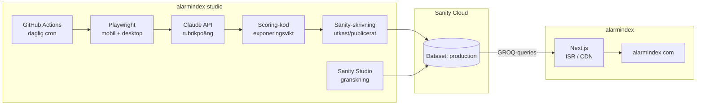

# Alarmindex — projektguide

Den här guiden beskriver hur Alarmindex är uppsatt, hur delarna kommunicerar med varandra, och vilka terminalkommandon som är bra att kunna.

## Vad är Alarmindex?

Alarmindex mäter hur **alarmistiskt formspråk** svenska nyhetsrubriker har — inte om nyheterna i sig är viktiga eller sanna. Varje dag scrapas löpsedlar från sex tidningar, rubriker poängsätts med AI, aggregeras till ett dagligt index (0–100), granskas vid behov, och publiceras till webbplatsen.

| Del | Repo | Syfte |
|-----|------|--------|
| **Webbplats** | `alarmindex` | Next.js-frontend på [alarmindex.com](https://alarmindex.com) |
| **Studio & pipeline** | `alarmindex-studio` | Sanity CMS, scraping, AI-scoring, granskning |
| **Databas** | Sanity (`production`) | Gemensam källa för all publicerad data |

Repona ligger normalt som syskonmappar:

```
projekt/
├── alarmindex/          ← frontend (detta repo)
└── alarmindex-studio/   ← Sanity + pipeline
```

---

## Hur delarna hänger ihop



**Viktigt:** Frontend och pipeline delar **inte** kod direkt vid körning. De kommunicerar enbart via **Sanity-dokument** i samma projekt och dataset. Frontend läser publicerade (`published`) snapshots; Studio och scripts skriver data.

### Dagligt flöde (steg för steg)

1. **GitHub Actions** (eller du lokalt) kör `npm run daily` i `alarmindex-studio`.
2. För varje aktiv tidning öppnar **Playwright** en headless Chromium, navigerar till tidningens `sourceUrl`, och försöker klicka bort cookie-rutor och paywalls.
3. **Rubrikextraktion:** DOM-scraping först; om för få rubriker hittas kompletteras med **vision** (screenshot → Claude).
4. **Screenshots** sparas: mobil above-the-fold (390×844) + desktopöversikt.
5. Varje rubrik **poängsätts av Claude** (temperatur 0) på fem dimensioner + känsla.
6. **Kod** (`lib/scoring.ts`) räknar slutpoäng med exponeringsvikt (above-fold väger tyngre) och dagspoäng: `0,7 × max + 0,3 × snitt`, normaliserat till 0–100.
7. Resultatet sparas i Sanity som `headline`, `headlineScore` och uppdaterad `frontPageSnapshot`.
8. **Publiceringsgrind:** Om overlay blockerade sidan eller för få rubriker (< 4) sparas som **utkast** (`draft`) i stället för `published`.
9. **Next.js** hämtar publicerad data via Sanity API (CDN i produktion) och cachar sidor (startsida revalideras var 5:e minut).

### Vad frontend läser

Frontend (`src/lib/sanity/`) kör GROQ-queries mot Sanity. Den visar bara dokument där `publicationStatus == "published"` (utom i förhandsvisningsläge). Viktiga sidor:

| Sida | Data |
|------|------|
| `/` | Senaste dagens rankade index, grafer, medelvärden |
| `/dag` | Lista över publicerade dagar |
| `/dag/[date]` | Alla tidningar en dag |
| `/dag/[date]/[slug]` | Rubriker, poäng, screenshots |
| `/tidning/[slug]` | Tidsserie och medelvärden per tidning |
| `/metodik` | Metodbeskrivning (delvis från Sanity `siteSettings`) |

---

## Datamodell i Sanity

```
newspaper (tidning)
  └── frontPageSnapshot (löpsedel per dag)
        ├── headline (rubrik)
        │     └── headlineScore (AI-dimensioner + slutpoäng)
        ├── screenshotAboveFold (bild)
        └── screenshotDesktop (bild)

siteSettings (singleton) — SEO-texter, titlar
```

| Dokument | Viktiga fält |
|----------|----------------|
| `newspaper` | `name`, `slug`, `sourceUrl`, `sourceType`, `active`, `sortOrder` |
| `frontPageSnapshot` | `date`, `dailyScore`, `publicationStatus`, `drivingHeadline` |
| `headline` | `text`, `aboveFoldMobile`, `sortOrder` |
| `headlineScore` | AI-dimensioner, `finalScore`, `displayScore`, `needsReview` |

Scoring-logiken finns i Studio (`lib/scoring.ts`) och speglas i frontend (`src/lib/scoring/`) för visning — håll dem synkade om du ändrar formler.

---

## Miljövariabler

### Frontend (`alarmindex/.env.local`)

Kopiera från `.env.example`:

| Variabel | Varför |
|----------|--------|
| `NEXT_PUBLIC_SANITY_PROJECT_ID` | Sanity-projektet frontend läser från |
| `NEXT_PUBLIC_SANITY_DATASET` | Normalt `production` |
| `NEXT_PUBLIC_SANITY_API_VERSION` | API-version för queries |
| `NEXT_PUBLIC_SITE_URL` | Kanonisk URL för metadata/sitemap |
| `SANITY_PREVIEW_SECRET` | Delad hemlighet för förhandsvisning |
| `SANITY_API_READ_TOKEN` | Viewer-token för draft/preview |

### Studio (`alarmindex-studio/.env`)

| Variabel | Varför |
|----------|--------|
| `SANITY_STUDIO_PROJECT_ID` | Samma projekt-ID som frontend |
| `SANITY_STUDIO_DATASET` | Normalt `production` |
| `ANTHROPIC_API_KEY` | Claude för rubrikpoäng och vision |
| `SANITY_AUTH_TOKEN` | (CI/scripts) Editor-token för skrivning |
| `SANITY_STUDIO_PREVIEW_SECRET` | Samma som `SANITY_PREVIEW_SECRET` i frontend |
| `SANITY_STUDIO_PREVIEW_URL` | Frontend-URL, t.ex. `http://localhost:3000` |

### Valfria vid körning (Studio)

| Variabel | Effekt |
|----------|--------|
| `CAPTURE_SLUG=dn` | Kör bara en tidning |
| `CAPTURE_DATE=2026-07-07` | Kör för specifikt datum |
| `HEADFUL=1` | Visa webbläsaren (felsökning) |
| `FORCE_DAILY=1` | Tvinga schemalagd körning att köra även om allt redan publicerats |
| `ANTHROPIC_MODEL` | Överstyr vilken Claude-modell som används |

**Windows (PowerShell):** använd `$env:CAPTURE_SLUG="dn"` före kommandot — npm sväljer ibland `--slug=`-flaggor.

---

## Terminalkommandon

### Första gången / utvecklingsmiljö

```powershell
# 1. Sanity CLI-inloggning (engångs)
cd C:\Users\simon\projekt\alarmindex-studio
npx sanity login

# 2. Installera beroenden
npm install
npx playwright install chromium

cd C:\Users\simon\projekt\alarmindex
npm install
```

```powershell
# 3. Seed — lägger in tidningar och exempeldata
cd C:\Users\simon\projekt\alarmindex-studio
npm run seed
```

**Varför:** Utan seed finns inga `newspaper`-dokument att scrapa, och frontend har inget att visa.

```powershell
# 4. Starta Studio (port 3333)
cd C:\Users\simon\projekt\alarmindex-studio
npm run dev

# 5. Starta frontend (port 3000) — separat terminal
cd C:\Users\simon\projekt\alarmindex
npm run dev
```

**Varför:** Studio för granskning och inställningar; frontend för att se resultatet som besökare.

---

### Daglig drift

```powershell
cd C:\Users\simon\projekt\alarmindex-studio
npm run daily
```

**Vad som händer:** Kör hela pipelinen (scraping → AI → screenshots → Sanity) för alla aktiva tidningar och dagens datum.

```powershell
$env:CAPTURE_SLUG="sydsvenskan"
npm run daily
```

**Varför:** Kör om en enskild tidning — t.ex. efter fix av overlay-config eller om en tidning misslyckades.

```powershell
$env:CAPTURE_DATE="2026-07-07"
$env:CAPTURE_SLUG="dn"
npm run daily
```

**Varför:** Backfill eller kör om en specifik dag.

I produktion körs samma kommando via **GitHub Actions** (`.github/workflows/daily.yml`):

| Schema | Tid (svensk) |
|--------|----------------|
| Mån–fre | 08:00 |
| Lör–sön | 10:00 |

Manuell körning: GitHub → Actions → Daily pipeline → Run workflow.

---

### Status och felsökning

```powershell
cd C:\Users\simon\projekt\alarmindex-studio
npx sanity exec scripts/list-day-status.ts --with-user-token
# eller med datum:
npx sanity exec scripts/list-day-status.ts --with-user-token 2026-07-07
```

**Varför:** Snabb översikt — vilka tidningar är `published`, dagspoäng, antal rubriker.

```powershell
$env:CAPTURE_SLUG="gp"
npx sanity exec scripts/diagnose-capture.ts --with-user-token
```

**Varför:** Testar bara Playwright-steget (overlays, DOM-rubriker, screenshots) utan AI-scoring. Sparar rapport i `.capture-diagnosis/`.

```powershell
$env:HEADFUL="1"
$env:CAPTURE_SLUG="sydsvenskan"
npm run daily
```

**Varför:** Se vad webbläsaren gör när något hänger sig.

```powershell
npm run test-ai
```

**Varför:** Verifierar att `ANTHROPIC_API_KEY` fungerar utan att köra hela pipelinen.

```powershell
npm run find-duplicates
```

**Varför:** Hittar dubbla snapshots/rubriker (körs också veckovis i CI).

---

### Sanity-hantering

```powershell
npm run seed                    # Grunddata (tidningar m.m.)
npm run add-sydsvenskan         # Lägg till en tidning utan att röra övrig data
npm run approve-all             # Godkänn alla rubriker som väntar på granskning
npm run reset-scrape-data       # Rensa scrape-data (försiktigt!)
npm run deploy                  # Publicera Studio till sanity.io
```

**Granskning i Studio:** Öppna **Behöver granskning** eller ett `frontPageSnapshot`-dokument med status `draft`. Publicera manuellt när du är nöjd.

---

### Frontend

```powershell
cd C:\Users\simon\projekt\alarmindex
npm run dev      # Lokal utveckling
npm run build    # Produktionsbygge
npm run lint     # ESLint
```

**Obs om cache:** Produktion (Vercel) cachar sidor via ISR. Startsidan revalideras var 5:e minut (`revalidate = 300`). Om du just publicerat ny data och alarmindex.com inte uppdaterats — vänta eller trigga redeploy. `localhost:3000` läser alltid färskt från Sanity.

---

## Publicering och deployment

| Komponent | Var | Hur |
|-----------|-----|-----|
| Frontend | Vercel | Push till `main` i `alarmindex` → automatisk deploy |
| Studio | sanity.io | `npm run deploy` i `alarmindex-studio` |
| Pipeline | GitHub Actions | Secrets: `SANITY_STUDIO_PROJECT_ID`, `SANITY_AUTH_TOKEN`, `ANTHROPIC_API_KEY` |

Frontend behöver **inte** veta när pipelinen körs. Nästa gång en sida revalideras eller byggs om hämtas ny data från Sanity.

---

## Vanliga problem

| Symptom | Trolig orsak | Åtgärd |
|---------|--------------|--------|
| Webb visar bara 1 tidning | ISR-cache från innan alla publicerats | Vänta på revalidate eller redeploy |
| Pipeline hänger på en tidning | Overlay/paywall eller långsam sida | `HEADFUL=1` + `diagnose-capture` |
| `ANTHROPIC_API_KEY saknas` | `.env` saknas eller fel i CI secrets | Lägg till i `.env` / GitHub Secrets |
| Playwright-fel | Chromium inte installerat | `npx playwright install chromium` |
| Utkast i stället för publicerat | Overlay blockerade eller < 4 rubriker | Granska `snapshotNote` i Studio |
| `--slug=` fungerar inte | npm sväljer flaggor på Windows | `$env:CAPTURE_SLUG="dn"` |

---

## Filstruktur (kort)

### alarmindex (frontend)

```
src/
├── app/              # Next.js App Router-sidor
├── components/       # UI, grafer, listor
└── lib/
    ├── sanity/       # Klient, queries, typer
    ├── scoring/      # Speglad poänglogik
    ├── chart-data.ts # Medelvärden och tidsserier
    └── newspaper-colors.ts
```

### alarmindex-studio

```
lib/
├── run-pipeline.ts       # Huvudflöde per tidning
├── persist-snapshot.ts   # Sparar till Sanity + publiceringsgrind
├── scoring.ts            # Poängformler (källan)
├── capture-page.ts       # Playwright-screenshots
├── scrape-headlines.ts   # DOM-extraktion
└── score-headline-ai.ts  # Claude-anrop
schemaTypes/              # Sanity-scheman
scripts/                  # CLI-entrypunkter (daily, seed, …)
.github/workflows/        # Schemalagd pipeline
```

---

## Relaterad dokumentation

- [README.md](../README.md) — snabbstart frontend
- [alarmindex-studio/README.md](../../alarmindex-studio/README.md) — Studio, pipeline, screenshots
- [Sanity Manage](https://www.sanity.io/manage) — API-tokens och projektinställningar
